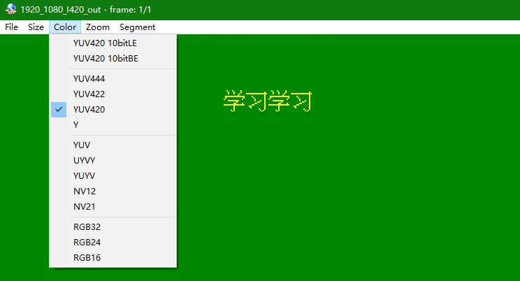

# <font color=#0099ff> **osd 点阵字符绘制** </font>

[](https://github.com/996icu/996.ICU/blob/master/LICENSE) [](https://996.icu) 

> `@think3r` 2019-08-18 20:45:21
> 参考链接:
> 1. [RealView® 编译工具-汇编程序指南(pdf)]()
> 2. [ARM Neon: conditional store suggestion](https://stackoverflow.com/questions/18312814/arm-neon-conditional-store-suggestion)
> 3. [how to use arm neon vbit intrinsics?](https://stackoverflow.com/questions/18784611/how-to-use-arm-neon-vbit-intrinsics)
> 4. [arm neon 相关文档和指令意义 - github](https://github.com/rogerou/Arm-neon-intrinsics)
> 5. [ARM Neon Intrinsics各函数介绍](https://blog.csdn.net/hemmingway/article/details/44828303/)
> 6. [ARM NEON Intrinsics -- gcc.gnu.org](https://gcc.gnu.org/onlinedocs/gcc-4.4.1/gcc/ARM-NEON-Intrinsics.html)
> 7. [总结各种RGB转YUV的转换公式](https://www.cnblogs.com/zhengjianhong/p/7872459.html)

## <font color=#009A000> 0x00 简介 </font>

通过 arm 平台下的 neon 技术加速如下两个多媒体 osd 字符功能:

1. 拓展 `1bit` 字符点阵至 `8bit` / `16bit` ;
2. 直接在多种 `YUV` 上叠加字符;

## <font color=#009A000> 0x01 support </font>

- arm 平台下 neon 加速 osd 字符点阵操作:
    1. 点阵(`1bit`) 扩充至 ` 1Byte` 和 `2Byte`;
        - 2 字节的输出可以是任意值, 如 `ARGB1555, ARGB4444, RGB565` 等等;
    2. 在 YUV 格式上直接绘制 OSD;
        - 支持 YUV420 中的 `I420, YV12, NV12, NV21`;
        - 支持 YUV422 中的 `YUYV, UYVY` ;
- 支持字符类型: 
    1. **汉字** (HZK16), 基础大小 `16*16`;
    2. **ASCII**, 基础大小 `8*16`;

- 支持字符大小:
  - ~~`u8` &nbsp; **: `x1, x2, x3, x4`**~~
  - `u16` **: `x1, x2, x3, x4`**
    - `u16` 点阵拓展包含两种实现:
      - cpu 叠加; 参见 [`./osd_Draw/cpu_osd.c`](./osd_Draw/cpu_osd.c)
        - cpu 叠加已调过性能, 可直接使用;
      - **<u>arm 下的 neon 加速叠加;</u> 参见 [`./osd_Draw/neon_osd.c`](./osd_Draw/neon_osd.c)**
        - 性能最好. 适用于支持 neon 的 arm 处理器;
  - YUV 叠加: **`x2, x4`** ;
    - 因为 YUV420 水平和垂直抽样 1/2, 所以暂不支持 **`x3 x4`**;

## <font color=#009A000> 0x02 使用方法 </font>

```
./
├── demo
│   ├── ASCII8
│   ├── HZK16
│   ├── inc
│   │   ├── build_time.h
│   │   ├── common.h
│   │   ├── neon_intrinsics_test.h
│   │   └── osd_test.h
│   ├── Makefile
│   ├── Makefile.android.clang  #高版本 ndk
│   ├── Makefile.android.gcc    #低版本 ndk
│   └── src
│       ├── build_time.c
│       ├── neon_intrinsics_test.c
│       ├── osd_test.c
│       └── test.c
└── osd_Draw
    ├── cpu_osd.c      #cpu 拓展 osd 字符点阵, 仅支持 u16
    ├── cpu_osd.h
    ├── neon_osd.c     #neon 加速实现 : 拓展 osd 字符点阵和 yuv 绘制字符
    ├── neon_osd.h
    ├── osd_base.c     #初始化相关
    └── osd_base.h
```

- 提供如下两种编译方法:
    1. 基于 `ndk-r20 clang` 的 Makefile -> `Makefile.android.clang`;
       - `@64bit` 可执行文件
    2. 基于 `ndk-r10e gcc` 的 Makefile -> `Makefile.android.gcc`;
       - `@32bit` 可执行文件

- 编译步骤如下 (以 `ndk-r20` 的 `clang` 编译为例):
    1. 打开 `test.c` 中想要测试的内容:
       - `test_CreatOsdDot_u16_func()` u16 拓展测试;
       - `test_DrawOsd_YUV_func()` yuv 叠加 osd 字符测试;
    2. 选取 Makefile, 如: `cp Makefile.android.clang Makefile`
    3. `vi Makefile` 并修改 `ndk-r20` 路径;
    4. `make clean && make`
    5. 传送成果物和必要的 yuv 文件至手机并运行 `./osd_demo`

- `u8` 和 `u16` 点阵简易查看方式: `beyond Compare 4`:
    1. 16 进制比较生成的两个 bin 文件 `osdOut.bin` 和 `osdOut_copy.bin` (文件内容相同);
    2. `视图` -> `布局` 中的 每组字节数, 配置为程序运行输出的 `pitch` 值; 如下图所示:
     

- yuv 字符叠加效果图:
    
  
## <font color=#009A000> 0x03 测试数据如下 </font>

### <font color=#FF4500> u16 点阵扩充 </font>

- 测试数据量为: `256,0000`
- 优化等级: `-O2`
- 测试手机: `小米6`
- 测试手机终端: `termux`
- 测试编译器: `ndk-r20-clang @ununtu`
- 测试程序为: `@64bit` 可执行文件;

| 字体规模 | cpu all | cpu average | neon all | neon average |
| --- | --- | --- | --- | --- |
| 8 * 16 | 433 ms | 0.169 us | 132 ms | 0.052 us |
| 16 * 32 | 1206 ms | 0.471 us | 341 ms | 0.133 us |
| 24 * 48 | 2164 ms | 0.845 us | 565 ms | 0.221 us |
| 32 * 64 | 2686 ms | 1.049 us | 861 ms | 0.334 us |
