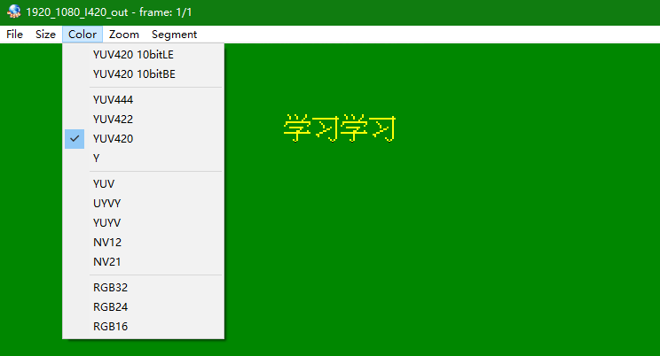
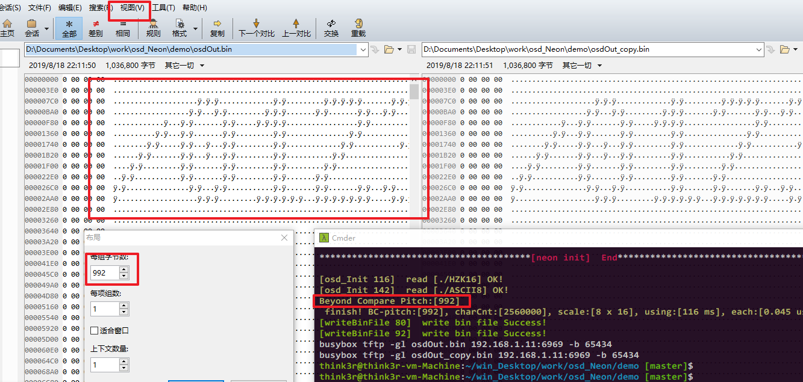

# <font color=#0099ff> **bitmap-fonts, osd, neon, draw, yuv** </font>

## :large_blue_circle: Internationalization

English | [中文文档](readme.md)

> `@think3r` 2019-08-18 20:45:21 <br />
> Reference:
> 1. [RealView® 编译工具-汇编程序指南(pdf)]()
> 2. [ARM Neon: conditional store suggestion](https://stackoverflow.com/questions/18312814/arm-neon-conditional-store-suggestion)
> 3. [how to use arm neon vbit intrinsics?](https://stackoverflow.com/questions/18784611/how-to-use-arm-neon-vbit-intrinsics)
> 4. [arm neon 相关文档和指令意义 - github](https://github.com/rogerou/Arm-neon-intrinsics)
> 5. [ARM Neon Intrinsics各函数介绍](https://blog.csdn.net/hemmingway/article/details/44828303/)
> 6. [ARM NEON Intrinsics -- gcc.gnu.org](https://gcc.gnu.org/onlinedocs/gcc-4.4.1/gcc/ARM-NEON-Intrinsics.html)
> 7. [总结各种RGB转YUV的转换公式](https://www.cnblogs.com/zhengjianhong/p/7872459.html)
> 8. [在线 Arm neon 汇编调试器](https://szeged.github.io/nevada/)
> 9. [NEON加速之memcpy在ARM平台的优化](https://www.jianshu.com/p/7b3bfc3aed12)

## <font color=#009A000> 0x00 Introduction </font>

Accelerate the following two multimedia OSD character overlay functions through neon technology under the arm platform :

1. Expand `1bit` dot-matrix-fonts(bitmap-fonts) to `8bit` / `16bit` ;
2. Render dot matrix fonts on several `YUV` formats;

    

## <font color=#009A000> 0x01 Support </font>

1. NEON-Accelerate :
    1. Dot-matrix(1bit) expanded to `1Byte` and `2Byte`;
        - The output of `2Byte` can be any value, such as `ARGB1555, ARGB4444, RGB565` etc.
    2. Draw OSD directly on the following YUV format :
        - `YUV420` support : `I420`, `YV12`, `NV12`, `NV21`;
        - `YUV422` support : `YUYV`, `UYVY`;
2. Support character types : 
    - **ASCII**, base size `8x16`;
    - **Chinese** (`HZK16`), base size `16*16`;
3. Support character specifications:
    1. Dot-matrix expanded :
        - `1Byte` : **`x2`, `x4`**;
            - ~~TODO : x1, x3~~
        - `2Byte` : **`x1, x2, x3, x4`**, contains two implementations:
            - Normal cpu expanded : @ [`./osd_Draw/cpu_osd.c`](./osd_Draw/cpu_osd.c)
            - Arm-neon cpu expanded with neon (Performance optimized) : @[`./osd_Draw/neon_osd.c`](./osd_Draw/neon_osd.c)
   2. YUV-OSD-Overlay : **`x2, x4`** ;
      - Does not support `x1` & `x3`, because YUV420 sampling 1/2 on horizontal and vertical ;

## <font color=#009A000> 0x02 Build </font>

```
./
├── CMakeLists.txt      # 分离的 cmake : 上层文件;
├── CMakeLists_one.txt  # 单独的 Cmake 文件(完整);
├── build               # cmake 构建文件夹
├── demo
│   ├── ASCII8          #英文字库
│   ├── CMakeLists.txt  # 分离的 cmake : demo 编译文件;
│   ├── HZK16           #汉字字库 GB2312
│   ├── inc
│   │   ├── build_time.h
│   │   ├── common.h
│   │   ├── neon_intrinsics_test.h
│   │   └── osd_test.h
│   ├── Makefile
│   ├── Makefile.android.clang  #高版本 ndk
│   ├── Makefile.android.gcc    #低版本 ndk
│   └── src
│       ├── build_time.c
│       ├── neon_intrinsics_test.c  #noen 内嵌函数测试, 与本项目无关
│       ├── osd_test.c
│       └── test.c
└── osd_Draw
    ├── CMakeLists.txt  # 分离的 cmake : 库文件编译;
    ├── cpu_osd.c      #cpu 拓展 osd 字符点阵, 仅支持 u16
    ├── cpu_osd.h
    ├── neon_osd.c     #neon 加速实现 : 拓展 osd 字符点阵和 yuv 绘制字符
    ├── neon_osd.h
    ├── osd_base.c     #初始化相关
    └── osd_base.h
```

- The following three compilation methods are provided:
    1. Makefile base on `ndk-r20+ clang` --> `Makefile.android.clang`;
       - To compile `@64bit` version;
    2. Makefile base on `ndk-r10e gcc` --> `Makefile.android.gcc`;
       - To compile `@32bit` version;
    3. CMake  --> `CMakeLists.txt` 和 `CMakeLists_one.txt`
       - To compile `@32bit` version;
- Build steps (take the `clang` compilation of `ndk-r20` as an example) :
    1. Open the content you want to test in `test.c`:
       - `test_CreatOsdDot_u16_func()` ---> u16 dot-expand;
       - `test_DrawOsd_YUV_func()` ---> yuv superimposed osd character test;
    2. Pick Makefile : `cp Makefile.android.clang Makefile`
    3. `vi Makefile` and chang `ndk-r20` path;
    4. `make clean && make`
    5. Send the executable-binary and necessary yuv files to the phone, then run `./osd_demo`

- `u8` 和 `u16` 点阵简易查看方式: `beyond Compare 4`:
    1. 16 进制比较生成的两个 bin 文件 `osdOut.bin` 和 `osdOut_copy.bin` (文件内容相同);
    2. `视图` -> `布局` 中的 每组字节数, 配置为程序运行输出的 `pitch` 值; 如下图所示:

     

- yuv-overlay example:

    
  
## <font color=#009A000> 0x03 Performance </font>

### <font color=#FF4500> u16 dot expand </font>

- Test data size : `256,0000`
- Compiler optimization level : `-O2`
- Test phone: `xiaomi-6`
- Phone environment: `termux`
- Compiler: `ndk-r20-clang @ununtu`
- The test procedure is `@64bit`;

| front scale | cpu all | cpu average | neon all | neon average |
| --- | --- | --- | --- | --- |
| 8 * 16 | 433 ms | 0.169 us | 132 ms | 0.052 us |
| 16 * 32 | 1206 ms | 0.471 us | 341 ms | 0.133 us |
| 24 * 48 | 2164 ms | 0.845 us | 565 ms | 0.221 us |
| 32 * 64 | 2686 ms | 1.049 us | 861 ms | 0.334 us |
